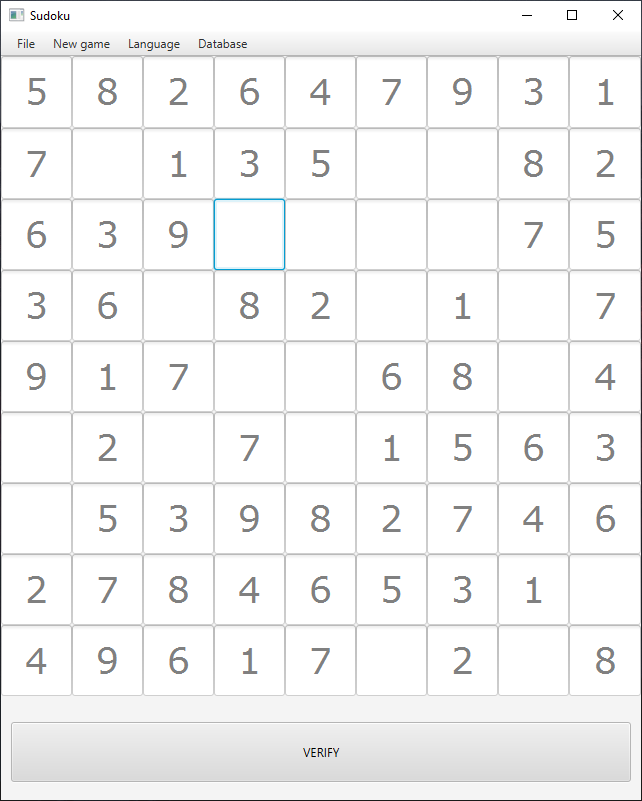
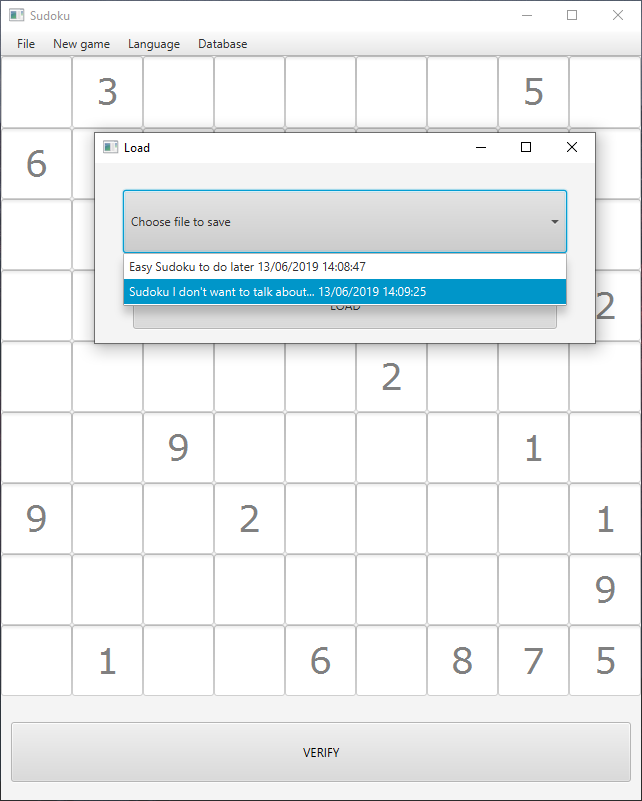
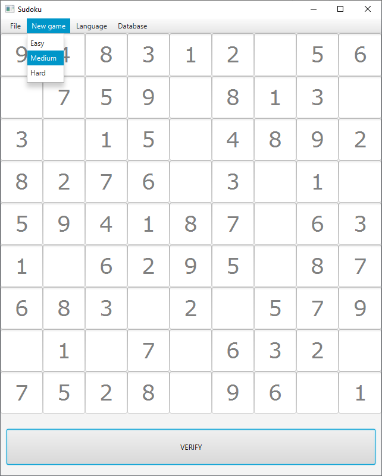

# Sudoku

Simple sudoku made in Java using JavaFX for implementation GUI. 

<p align="center">
  
  
  
</p>

## Getting Started

These instructions will get you a copy of the project up and running on your local machine for development and testing purposes. See deployment for notes on how to deploy the project on a live system.

### Cloning

```
$ git clone https://github.com/msuliborski/sudoku
```

### Building

```
$ cd sudoku
$ mvn install
```

### Usage

Simply run and solve sudoku :)

## Built with

* [JavaFX](https://openjfx.io/) - open source, next generation client application platform for desktop, mobile and embedded systems built on Java.


## Authors

* **Michał Suliborski** - [msuliborski](https://github.com/msuliborski)
* **Jędrzej Szor** - [jedrekszor](https://github.com/jedrekszor)

## License

This project is licensed under the MIT License - see the [LICENSE.md](LICENSE.md) file for details


